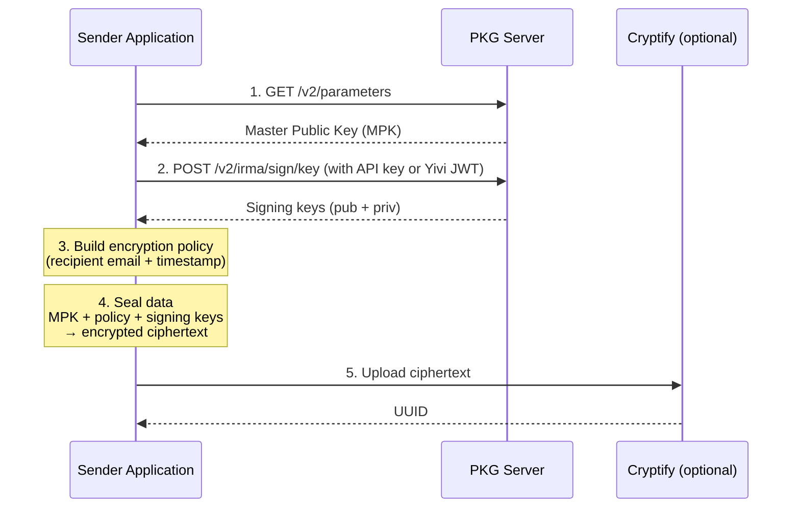
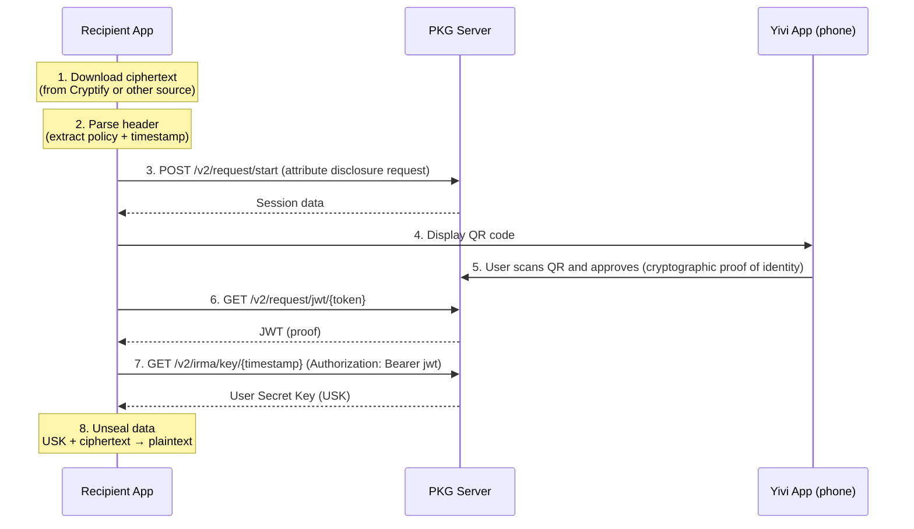

# System Architecture

This page describes PostGuard's components, how they communicate, and the key hierarchy that makes Identity-Based Encryption work.

## Components

PostGuard consists of four main parts:

| Component | Role | Required? |
|---|---|---|
| PKG server (`pg-pkg`) | Trusted server that holds the master key pair. Publishes the Master Public Key, verifies identities via Yivi, and issues decryption and signing keys. | Yes |
| Yivi app | Mobile identity wallet. Users prove they own an email address (or other attributes) by scanning a QR code. | Yes (for decryption and peer-to-peer signing) |
| Client SDK (`@e4a/pg-js`) | JavaScript/TypeScript library that handles encryption, decryption, policy building, and communication with the PKG and Cryptify. Uses `@e4a/pg-wasm` for cryptographic operations. | Yes |
| Cryptify | File hosting service for encrypted files. Handles upload, download, and optional email notifications. | No, you can deliver ciphertext yourself |

There are also client applications built on the SDK:

| Application | Description |
|---|---|
| PostGuard website | SvelteKit web app for encrypting and sharing files via Cryptify |
| Thunderbird addon | Extension for Thunderbird 128+ that encrypts and decrypts emails |
| Outlook addon | Office add-in that encrypts and decrypts emails in Outlook |
| CLI tool (`pg-cli`) | Command-line tool for encrypting and decrypting files |

## Key Hierarchy

PostGuard's cryptography is built on a two-level key hierarchy:

```
Master Key Pair (lives on the PKG server)
  |
  +-- Master Public Key (MPK)
  |     Published at GET /v2/parameters
  |     Fetched by senders before encryption
  |     Combined with recipient identity + timestamp to encrypt
  |
  +-- Master Secret Key (MSK)
        Never leaves the PKG
        Used to derive User Secret Keys
              |
              +-- User Secret Key (USK)
                    Derived from MSK + recipient identity + timestamp
                    Issued to recipient after identity verification
                    Time-limited (expires at 4 AM next day)
                    Used to decrypt ciphertext
```

The PKG also holds a separate IBS master key pair for Identity-Based Signatures (the GG scheme). This produces signing keys and a public verification key:

```
IBS Master Key Pair (lives on the PKG server)
  |
  +-- Verification Key
  |     Published at GET /v2/sign/parameters
  |     Used by recipients to verify sender signatures
  |
  +-- IBS Master Secret Key
        Used to derive per-sender signing keys
```

## Session Flow

A typical PostGuard session works as follows. Red actions require user interaction; all other actions are automatic.

<p align="center">
  
</p>

0. The PKG generates a master key pair.
1. Alice's client retrieves the public master key from the PKG.
2. Alice uses the public master key and Bob's identity to encrypt a message.
3. Alice's client sends the ciphertext to Bob via any channel.
4. Bob's client asks for a key to decrypt the ciphertext.
5. The PKG starts an authentication session at the Yivi server.
6. Bob is asked to reveal his identity via a QR code.
7. Bob reveals his identity.
8. The Yivi server sends the authentication results to the PKG.
9. The PKG issues a key for Bob's identity.
10. Bob's client decrypts the ciphertext using his key.

The sections below break down the encryption and decryption steps in more detail.

## Encryption Flow

Here is what happens when a sender encrypts data:



Step by step:

1. The SDK fetches the Master Public Key from the PKG. This is a single GET request. The result can be cached (the PKG supports ETags and Cache-Control headers).
2. The sender authenticates (via API key or Yivi) to obtain signing keys that embed their identity in the ciphertext. The PKG returns both a public signing key and an optional private signing key.
3. The SDK builds an encryption policy: a mapping from each recipient's identifier to the attributes they must prove, plus a timestamp for key expiry.
4. The SDK seals the data using the `@e4a/pg-wasm` WebAssembly module. For files, the SDK creates a ZIP archive, then encrypts the ZIP stream. The output is a binary blob that can only be decrypted by someone who satisfies the policy.
5. Optionally, the ciphertext is uploaded to Cryptify, which returns a UUID. Cryptify can also send email notifications to recipients.

## Decryption Flow

Here is what happens when a recipient decrypts:



Step by step:

1. The recipient obtains the ciphertext (downloaded from Cryptify, received as an email attachment, extracted from an HTML body, etc.).
2. The SDK parses the ciphertext header to extract the policy: which attributes are required and what timestamp was used. It also extracts the sender's public identity if the message was signed.
3. The SDK starts a Yivi session via the PKG, requesting the attributes specified in the policy.
4. The application displays a QR code (or triggers a deep link on mobile).
5. The recipient scans the QR code with their Yivi app and approves the attribute disclosure.
6. The SDK retrieves a JWT from the PKG that proves the Yivi session completed successfully.
7. The SDK requests the User Secret Key (USK) from the PKG, passing the JWT and the timestamp from the ciphertext. The PKG verifies the proof and derives the USK from its Master Secret Key.
8. The SDK unseals the ciphertext using the USK, producing the original plaintext. It also verifies the sender's signature if one was present.

::: tip Streaming support
Both encryption and decryption support streaming (`ReadableStream`/`WritableStream`), so large files are processed in chunks (256 KiB by default) without loading everything into memory at once.
:::

## API Endpoints

### PKG Server

#### Public Parameters

| Method | Endpoint | Description |
|---|---|---|
| `GET` | `/v2/parameters` | Fetch the Master Public Key (MPK). Supports ETag/Cache-Control caching. |
| `GET` | `/v2/sign/parameters` | Fetch the public verification key for signature checking. |

#### Yivi Sessions

| Method | Endpoint | Description |
|---|---|---|
| `POST` | `/v2/request/start` | Start a Yivi identity verification session. Accepts attribute disclosure requirements. |
| `GET` | `/v2/request/jwt/{token}` | Retrieve the JWT result of a completed Yivi session. |

#### Key Issuance

| Method | Endpoint | Description |
|---|---|---|
| `GET` | `/v2/irma/key/{timestamp}` | Retrieve a User Secret Key (USK). Requires `Authorization: Bearer <jwt>`. The timestamp must match the one embedded in the ciphertext. |
| `POST` | `/v2/irma/sign/key` | Retrieve signing keys. Authenticate with either an API key (`Bearer PG-API-...`) or a Yivi JWT. |

#### Health

| Method | Endpoint | Description |
|---|---|---|
| `GET` | `/health` | Health check endpoint. |
| `GET` | `/metrics` | Prometheus metrics endpoint. |

::: warning Authentication
The key issuance endpoints require a valid `Authorization: Bearer <jwt>` header. The JWT is obtained through a completed Yivi session (for end-users) or provided as an API key prefixed with `PG-API-` (for server-to-server use).
:::

### Cryptify Server

| Method | Endpoint | Description |
|---|---|---|
| `POST` | `/fileupload/init` | Initialize a file upload. Returns a UUID and upload token. |
| `PUT` | `/fileupload/{uuid}` | Upload a chunk. Uses `Content-Range` headers for offset tracking. Requires `cryptifytoken` header. |
| `POST` | `/fileupload/finalize/{uuid}` | Finalize the upload after all chunks are sent. |
| `GET` | `/filedownload/{uuid}` | Download an encrypted file as a stream. |

## Component Diagram

```
+-------------------+          +-------------------+
|   Sender App      |          |   Recipient App   |
|  (uses @e4a/pg-js)|          |  (uses @e4a/pg-js)|
+--------+----------+          +--------+----------+
         |                              |
    encrypt                        decrypt
         |                              |
         v                              v
+-------------------+          +-------------------+
|    PKG Server     |<-------->|     Yivi App      |
|    (pg-pkg)       |  verify  |   (on phone)      |
|                   |  identity|                   |
| - Holds MPK / MSK |          | - Holds verified  |
| - Issues USKs     |          |   attributes      |
| - Issues sign keys|          +-------------------+
+-------------------+
         ^
         |
         v
+--------------------+
| Cryptify (optional)|
|                    |
| - Stores encrypted |
|   files            |
| - Sends email      |
|   notifications    |
+--------------------+
```

The sender and recipient applications both use the `@e4a/pg-js` SDK, which internally uses `@e4a/pg-wasm` for cryptographic operations. The sender talks to the PKG (for parameters and signing keys) and optionally to Cryptify (for file hosting). The recipient talks to the PKG, which coordinates with the Yivi app on the recipient's phone to verify identity before issuing a decryption key.
